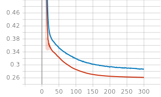

# 加州房价预测
[Kaggle Competition链接](https://www.kaggle.com/competitions/california-house-prices/overview)

## 模型
模型为多层感知机，线性层之间加入了Dropout

***由于在多个线性层后加入了dropout，若设置p过大会导致train_loss大于val_loss***

## Loss曲线

## 预测结果
Private Score : 0.19315 \
Public Score : 0.20128
